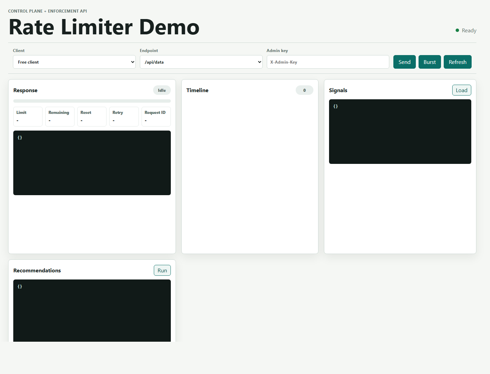
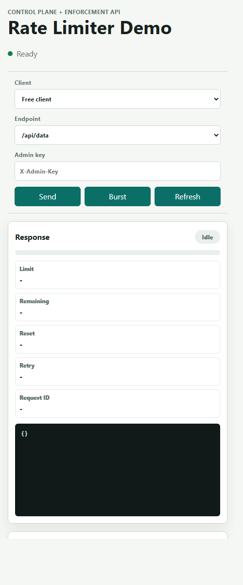

# Distributed Rate Limiter

A production-inspired distributed rate limiter built with **FastAPI** and **Redis**. The project is intentionally compact: it is small enough to read in one sitting, but complete enough to demonstrate token-bucket enforcement, atomic Redis Lua evaluation, durable rule management, response headers, and passive telemetry.

This repository has been upgraded into a portfolio-ready "Rate Limiter Control Plane + Enforcement API." The next research track explores AI-assisted rate-limit analysis while keeping the enforcement path deterministic and safe.

## Current Features

- **Token Bucket Engine**: Continuous token regeneration tracked in Redis.
- **Multiple Algorithms**: Rules can use `token_bucket`, `fixed_window`, or `sliding_window`.
- **Atomic Redis Evaluation**: Lua scripting keeps token updates race-safe across concurrent requests.
- **Rule Configuration**: Per-route global limits and identifier-specific overrides are loaded from `rules.json` by default, with an optional SQLite-backed rule store for durable demos.
- **Rule Metadata**: Rules can carry route tier, owner, and sensitivity labels into validation, logs, and limiter traces.
- **Templated Route Keys**: Parameterized FastAPI routes use their route template for rule lookup and telemetry.
- **Rate Limit Headers**:
  - `X-RateLimit-Limit`
  - `X-RateLimit-Remaining`
  - `X-RateLimit-Reset`
  - `Retry-After` on HTTP `429`
- **Fail-Open Behavior**: Redis failures currently allow requests so the API remains available during limiter outages.
- **Passive Telemetry**: In-memory signals capture recent allow/deny behavior and top offenders.
- **Optional Persistent Telemetry**: `PERSIST_TELEMETRY=true` records rate-limit decisions to SQLite for restart-safe demo analytics.
- **Recommendations Endpoint**: A lightweight recommendation layer summarizes recent traffic patterns without changing rules automatically.
- **AI Research Roadmap**: The next backlog expands passive recommendations into feature extraction, explainable advisors, replay-based dry-runs, anomaly detection, an optional LLM copilot, and repeatable evaluation scenarios.
- **AI Feature Foundation**: Rate-limit telemetry now carries rule and request context for route, identifier, and route-identifier feature summaries.
- **Advisor V2**: Deterministic tuning, abuse, reliability, and algorithm advisors return structured recommendations with confidence, rationale, proposed changes, expected impact, and safety notes.
- **Replay Dry Run**: Policy dry-runs include a deterministic replay report with newly denied, newly allowed, route impact, identifier impact, and sensitive-route impact.
- **Anomaly Detection**: Deterministic findings flag route spikes, retry loops, concentrated offenders, sensitive-route probing, and Redis outage exposure with evidence and suggested next actions.
- **Optional Policy Copilot**: A disabled-by-default control-plane endpoint can explain AI signals and validate/dry-run generated rule JSON through a provider adapter, with a deterministic fake provider for local tests and an opt-in OpenAI-compatible HTTP adapter.
- **AI Evaluation Harness**: `scripts/ai_eval.py` runs repeatable labeled scenarios and reports recommendation/anomaly precision, false-positive notes, denied-legitimate estimates, abuse-reduction estimates, and policy-stability status.
- **Persisted AI Replay**: The AI evaluation harness can replay SQLite telemetry windows from real demo runs for observed-label reports or scenario comparisons.
- **Live AI Evaluation**: `scripts/ai_live_eval.py` drives a running app over HTTP and compares captured Redis-backed behavior with the synthetic AI evaluation baseline.
- **AI Research Report Artifact**: `scripts/ai_research_report.py` generates a compact Markdown report from synthetic, live, outage, and persisted evaluation summaries.
- **CI AI Dry Run**: `scripts/ai_ci_dry_run.py` generates synthetic and seeded SQLite evaluation artifacts without Docker, Redis, or a live app.
- **CI AI Artifacts**: GitHub Actions uploads the AI dry-run report bundle as the `ai-ci-dry-run` artifact, including `MANIFEST.md` and `manifest.json` indexes.
- **AI Research Report API**: `GET /admin/ai/research-report` exposes the latest generated Markdown report to the dashboard and admin clients.
- **Dashboard Screenshot Refresh**: `scripts/dashboard_screenshots.py` can refresh desktop and mobile dashboard screenshots with the AI Research Report panel loaded when Playwright is installed.
- **Admin Rule API**: `X-Admin-Key` protects rule inspect, validate, update, approval, and reload endpoints.
- **Operational Endpoints**: `/health`, `/ready`, and `/metrics` expose process health, Redis readiness, and Prometheus-style counters.
- **Docker Health Checks**: Compose marks Redis and the web app healthy only after Redis responds and `/ready` succeeds.
- **Proxy Trust Policy**: `X-Forwarded-For` is ignored unless the direct peer is listed in `TRUSTED_PROXY_IPS`.
- **Request Tracing**: `X-Request-ID` is accepted or generated and echoed on responses.
- **Optional OpenTelemetry Tracing**: `ENABLE_TRACING=true` emits request and limiter spans, returns `X-Trace-ID`, and can export traces to an OTLP/HTTP collector.
- **Interactive Demo Dashboard**: `/demo` provides browser controls for request simulation, live headers, signals, persisted telemetry summaries, recommendations, and active rules.

## Architecture

```text
Client
  |
  | X-API-Key or client IP
  v
FastAPI route dependency
  |
  | route path + identifier
  v
RulesManager
  |
  | rate + capacity
  v
Redis Lua token bucket
  |
  | allow / deny + remaining tokens
  v
Response headers + telemetry event
```

Core modules:

- `app/main.py`: FastAPI app, routes, and lifecycle wiring.
- `app/api/depends.py`: rate-limit dependency and response header handling.
- `app/core/limiter.py`: Redis Lua token-bucket implementation.
- `app/core/rules.py`: rule-store loading, history, approvals, and rule lookup.
- `app/models/rules.py`: Pydantic rule models.
- `app/ai/telemetry.py`: in-memory signals and recommendations.
- `app/observability/telemetry_store.py`: optional SQLite persistence for rate-limit events.

AI research architecture is tracked in [docs/AI_RESEARCH_ROADMAP.md](docs/AI_RESEARCH_ROADMAP.md) and [docs/AI_FEATURE_DESIGN.md](docs/AI_FEATURE_DESIGN.md). The intended design is control-plane only: telemetry feeds feature extraction and advisors, advisors produce policy proposals, and proposals must pass validation, dry-run, audit, approval, and rollback controls before any rule change.

## Known Tradeoffs

This project is production-inspired, not fully production-ready yet. The current tradeoffs are explicit:

- **Telemetry persistence is optional**: in-memory signals stay as the fast path; SQLite persistence is best-effort and off by default.
- **Rule storage is local**: JSON remains the readable default; optional SQLite persists active rules, history, and pending approvals, but this is still not a multi-user control-plane database.
- **Demo admin keys**: admin and AI endpoints are protected by `X-Admin-Key`, with a development default and optional named keys for local rotation demos.
- **Fail-open by default**: good for availability demos, risky for sensitive endpoints; sensitive demo routes can opt into fail-closed.
- **Identifier hashing defaults off**: API keys and IPs can be hashed in Redis keys and telemetry with `HASH_IDENTIFIERS=true`, but the default keeps demo behavior easy to inspect.

These are intentionally tracked in [docs/IMPLEMENTATION_PLAN.md](docs/IMPLEMENTATION_PLAN.md) and [docs/EXECUTION_STRATEGY.md](docs/EXECUTION_STRATEGY.md).

The AI research backlog is intentionally tracked separately in [docs/AI_RESEARCH_ROADMAP.md](docs/AI_RESEARCH_ROADMAP.md), because it is a new research phase rather than unfinished MVP work.

## Tech Stack

- **Backend**: Python 3.11+, FastAPI
- **Limiter State**: Redis 7
- **Atomicity**: Redis Lua scripting
- **Validation**: Pydantic
- **Testing**: Pytest, pytest-asyncio, fakeredis, and coverage reporting
- **Security Checks**: pip-audit dependency audit, Bandit static scan, and CycloneDX SBOM generation
- **Demo UI**: Static HTML/CSS/JavaScript served by FastAPI
- **Deployment**: Docker and Docker Compose

## Running With Docker

Docker Compose starts two services:

- `web`: FastAPI app at `http://localhost:8001`
- `redis`: Redis at `localhost:6378`
- `otel-collector`: optional OpenTelemetry collector, enabled with the `tracing` profile

Compose health checks wait for Redis readiness and then verify the web app through `/ready`.

```bash
docker compose up --build
```

Run the app with the local OpenTelemetry collector profile:

```powershell
$env:ENABLE_TRACING="true"
$env:TRACE_CONSOLE_EXPORTER="false"
$env:TRACE_OTLP_ENABLED="true"
$env:TRACE_OTLP_ENDPOINT="http://otel-collector:4318/v1/traces"
docker-compose --profile tracing up --build
```

In another terminal, generate a request and watch collector logs:

```bash
curl http://localhost:8001/api/data -H "X-API-Key: trace-demo"
docker-compose logs otel-collector --tail 100
```

The collector keeps the standard OTLP ports inside the Compose network and publishes host ports `14317` and `14318` to avoid common local conflicts.

Run tests inside the app container:

```bash
docker compose exec web pytest -q
```

Stop the stack:

```bash
docker compose down
```

## Running Locally

Docker is the recommended path for reviewers because it includes Redis. For local Python development, create a fresh virtual environment with Python 3.11 or newer:

```powershell
uv venv .venv --python 3.11
uv pip install --python .\.venv\Scripts\python.exe -r requirements-dev.txt
.\.venv\Scripts\python.exe -m uvicorn app.main:app --reload
```

In another terminal, make sure Redis is available at `redis://localhost:6379/0`, then run:

```powershell
.\.venv\Scripts\pytest.exe -q
```

If an old virtual environment points to a missing Python installation, recreate it before running tests.

## Developer Commands

```bash
make test
make coverage
make lint
make security
make sbom
make compose-up
make load-test
make ai-eval
make ai-eval-persisted
make ai-live-eval
make ai-live-eval-outage
make ai-research-report
make ai-ci-dry-run
make dashboard-screenshots
make redis-outage-demo
```

Without `make`, the equivalent checks are:

```powershell
.\.venv\Scripts\pytest.exe -q
.\.venv\Scripts\pytest.exe --cov=app --cov=scripts --cov-report=term-missing --cov-report=xml
.\.venv\Scripts\ruff.exe check .
.\.venv\Scripts\bandit.exe -q -r app -c pyproject.toml
.\.venv\Scripts\cyclonedx-py.exe requirements requirements.txt --of JSON --output-reproducible --output-file sbom.json
docker compose up --build
.\.venv\Scripts\python.exe scripts\load_test.py --base-url http://localhost:8001
.\.venv\Scripts\python.exe scripts\ai_eval.py
.\.venv\Scripts\python.exe scripts\ai_eval.py --telemetry-db data/telemetry.sqlite3
.\.venv\Scripts\python.exe scripts\ai_live_eval.py --base-url http://localhost:8001
.\.venv\Scripts\python.exe scripts\ai_live_eval.py --base-url http://localhost:8001 --include-redis-outage
.\.venv\Scripts\python.exe scripts\ai_research_report.py --output docs/AI_RESEARCH_REPORT.md
.\.venv\Scripts\python.exe scripts\ai_ci_dry_run.py
.\.venv\Scripts\python.exe scripts\dashboard_screenshots.py --base-url http://localhost:8001
.\.venv\Scripts\python.exe scripts\redis_outage_demo.py --base-url http://localhost:8001
```

## CI Artifacts

GitHub Actions uploads these review artifacts from the main CI job. Each artifact is retained for 30 days.

| Artifact | Source | What to open first |
| --- | --- | --- |
| `coverage-xml` | `coverage.xml` from `pytest --cov=app --cov=scripts` | Use for coverage tooling or line-level coverage review. |
| `cyclonedx-sbom` | `sbom.json` from `cyclonedx-py requirements` | Use for dependency inventory and supply-chain review. |
| `ai-ci-dry-run` | `tmp-test-data/ai-ci-dry-run` from `scripts/ai_ci_dry_run.py` | Open `MANIFEST.md`, then `AI_RESEARCH_REPORT.md`, then `summary.json`. |

The AI dry-run artifact is intentionally self-contained and CI-safe. It does not require Docker, Redis, network access, or a running app. To inspect available seeded replay scenarios locally:

```powershell
.\.venv\Scripts\python.exe scripts\ai_ci_dry_run.py --list-scenarios
```

The checked-in dashboard screenshots can be refreshed from a running app. The script targets the AI Research Report panel, writes `docs/assets/demo-dashboard-desktop.png` and `docs/assets/demo-dashboard-mobile.png`, and exits cleanly with a skipped status when the optional Playwright browser package is not installed:

```powershell
.\.venv\Scripts\python.exe scripts\dashboard_screenshots.py --base-url http://localhost:8001
```

## Configuration

Rules live in [rules.json](rules.json).

By default, active rules, history, and pending approvals are stored beside `rules.json`:

```powershell
RULE_STORE_BACKEND=json
RULES_PATH=rules.json
```

For a restart-safe local control-plane demo, switch to SQLite. The first run seeds the database from `RULES_PATH`; later admin updates persist to SQLite without rewriting the seed JSON file.

```powershell
RULE_STORE_BACKEND=sqlite
RULE_STORE_DB_PATH=data/rules.sqlite3
RULES_PATH=rules.json
```

```json
{
  "routes": {
    "/api/data": {
      "global_limit": {
        "rate": 1.0,
        "capacity": 5,
        "algorithm": "token_bucket",
        "fail_mode": "open",
        "tier": "free",
        "owner": "api-platform",
        "sensitivity": "internal"
      },
      "overrides": {
        "premium_user_key": {
          "rate": 10.0,
          "capacity": 100,
          "tier": "premium",
          "owner": "customer-platform",
          "sensitivity": "internal"
        }
      }
    }
  }
}
```

Behavior today:

- `X-API-Key` is used as the rate-limit identifier when present.
- Client IP is used when `X-API-Key` is missing.
- Identifier-specific overrides win over the route's global limit.
- Optional `tier`, `owner`, and `sensitivity` metadata is validated with rules and included in decision logs and tracing attributes.
- Missing routes fall back to a default rule.
- `/health` is not rate-limited.
- `/api/data` uses `token_bucket` by default.
- `/api/limited-health` uses `fixed_window` for demo traffic.
- `/api/accounts/{account_id}/data` demonstrates templated route matching and `sliding_window` limits for path parameters.
- `PERSIST_TELEMETRY=true` enables SQLite event persistence.
- `TELEMETRY_DB_PATH=data/telemetry.sqlite3` controls the SQLite database path.
- `TRUSTED_PROXY_IPS` is a comma-separated list of proxy IPs or CIDR ranges allowed to supply `X-Forwarded-For`.
- `AI_COPILOT_ENABLED=false` keeps the policy copilot off unless explicitly enabled.
- `AI_COPILOT_PROVIDER=fake` selects the deterministic local/test adapter.
- `AI_COPILOT_PROVIDER=openai_compatible` sends a chat-completions-style request to `AI_COPILOT_ENDPOINT`.
- `AI_COPILOT_ENDPOINT` is required for the `openai_compatible` adapter.
- `AI_COPILOT_API_KEY` optionally adds a bearer token for the provider request.
- `AI_COPILOT_MODEL=policy-copilot` sets the model name sent to the provider.
- `AI_COPILOT_TIMEOUT_S=10.0` limits provider request duration.
- `AI_RESEARCH_REPORT_PATH=docs/AI_RESEARCH_REPORT.md` points the admin report endpoint at the latest generated Markdown artifact.

## Operations

- `GET /health`: process health, not rate-limited.
- `GET /ready`: Redis readiness.
- `GET /metrics`: Prometheus-style in-memory counters.
- `X-Request-ID`: accepted when provided, generated when missing, and echoed on every response.
- `X-Trace-ID`: emitted when OpenTelemetry tracing is enabled.
- `TRACE_OTLP_ENABLED=true`: exports spans to an OTLP/HTTP collector when tracing is enabled.
- `TRACE_OTLP_ENDPOINT`: optional trace endpoint such as `http://localhost:4318/v1/traces` for local Python with an external collector, `http://localhost:14318/v1/traces` for local Python using the Compose collector, or `http://otel-collector:4318/v1/traces` for Docker Compose.
- `TRACE_OTLP_HEADERS`: optional comma-separated OTLP headers, such as `authorization=Bearer token,x-tenant=demo`.

## Proxy Trust

By default, rate-limit identity uses `X-API-Key` when present and otherwise falls back to the direct client socket IP. The app deliberately ignores `X-Forwarded-For` unless the direct peer is explicitly trusted.

Set `TRUSTED_PROXY_IPS` only to reverse proxies you control:

```bash
TRUSTED_PROXY_IPS=10.0.0.10,10.0.1.0/24
```

When the direct peer matches that allowlist, the first valid IP in `X-Forwarded-For` is used as the anonymous client identity. Do not set this to broad public ranges; untrusted clients can spoof this header.

## Admin API

Admin endpoints use the `X-Admin-Key` header. The development default is `dev-admin-key`.

```bash
curl http://localhost:8001/admin/rules -H "X-Admin-Key: dev-admin-key"
```

For local key rotation demos, keep the legacy `ADMIN_API_KEY` fallback and add named keys with `ADMIN_API_KEYS`:

```powershell
ADMIN_API_KEY=dev-admin-key
ADMIN_API_KEYS=primary:primary-key,backup:backup-key
```

Named keys are accepted alongside the legacy key. When an admin mutation omits `X-Audit-Actor`, the matched key name becomes the default audit actor, such as `primary` or `backup`.
Use `GET /admin/keys` to confirm the active key name and configured key names during local rotation demos. The endpoint never returns secret key values.

Rule-changing endpoints can include optional audit headers:

- `X-Audit-Actor`: human or automation actor.
- `X-Audit-Source`: dashboard, runbook, CLI, or integration source.
- `X-Audit-Reason`: short reason for the change.

Available endpoints:

- `GET /admin/rules`
- `GET /admin/keys`
- `GET /admin/ai/anomalies`
- `GET /admin/ai/research-report`
- `POST /admin/ai/policy-copilot`
- `GET /admin/rules/export`
- `GET /admin/telemetry/persistent`
- `GET /admin/rules/history`
- `GET /admin/rules/audit`
- `GET /admin/rules/pending`
- `POST /admin/rules/validate`
- `POST /admin/rules/dry-run`
- `POST /admin/rules/import`
- `POST /admin/rules/recommendation-draft`
- `PUT /admin/rules`
- `POST /admin/rules/pending/{approval_id}/approve`
- `POST /admin/rules/pending/{approval_id}/reject`
- `POST /admin/rules/rollback/{version}`
- `POST /admin/rules/reload`

Changes that touch routes labeled with `sensitivity: "sensitive"` are saved as pending approvals instead of applying immediately. A second admin, identified by a different `X-Audit-Actor`, must approve the pending change before it updates the active rule store and rule history.

The rule audit endpoint accepts optional `route`, `actor`, `action`, `sensitivity`, `since`, `until`, and `limit` query parameters for focused change review.

Use `GET /admin/rules/export` to download a portable rule-policy envelope with schema metadata, store backend, current version, and rule JSON. Use `POST /admin/rules/import` with either that envelope or raw rule JSON to restore a demo policy; imports are validated before applying, recorded in rule history, and sensitive-route imports require the same pending approval flow as direct updates.

The recommendation draft endpoint converts current AI recommendations into editable proposed rule JSON and returns a dry-run report. It never applies changes automatically.

The policy copilot endpoint is disabled by default. When enabled with `AI_COPILOT_ENABLED=true`, it returns explanation text and can validate plus dry-run generated rule JSON. It never applies changes directly; sensitive-route drafts still have to go through the existing approval flow. Local tests use the deterministic `fake` provider; demos can opt into `openai_compatible` for providers that expose a chat completions JSON API.

The generated OpenAPI schema includes examples for rule metadata, dry runs, imports, rollbacks, and persistent telemetry filters. Open `/docs` while the app is running to use those examples from Swagger UI.

The AI research report endpoint returns the configured Markdown artifact with metadata by default, can return raw `text/markdown` with `?format=markdown`, and the dashboard includes an AI Research Report panel that loads the JSON view or downloads the Markdown with `X-Admin-Key`.

## Portfolio Demo Walkthrough

Start the stack:

```bash
docker compose up --build
```

Open the dashboard:

```text
http://localhost:8001/demo
```

Dashboard preview:



Narrow layout preview:



Use the dashboard to send single requests, send a burst, compare free and premium clients, inspect rate-limit headers, load admin-only signals/persisted telemetry/rules/history, filter persisted telemetry by time range, and dry-run proposed policy changes with `X-Admin-Key`.

Trigger the global `/api/data` limit:

```powershell
for ($i = 1; $i -le 7; $i++) {
  curl.exe -i http://localhost:8001/api/data -H "X-API-Key: free_user_key"
}
```

Compare a premium client override:

```powershell
for ($i = 1; $i -le 7; $i++) {
  curl.exe -i http://localhost:8001/api/data -H "X-API-Key: premium_user_key"
}
```

Run the benchmark script:

```powershell
.\.venv\Scripts\python.exe scripts\load_test.py --base-url http://localhost:8001
```

Representative local Docker Compose output:

```json
{
  "free-data": {
    "requests": 12,
    "limited": 7,
    "errors": 0
  },
  "premium-data": {
    "requests": 12,
    "limited": 0,
    "errors": 0
  },
  "limited-health": {
    "requests": 14,
    "limited": 4,
    "errors": 0
  },
  "templated-account-data": {
    "requests": 12,
    "limited": 7,
    "errors": 0
  }
}
```

This covers the default free rule, the premium override, the abusive fixed-window health route, and the templated `/api/accounts/{account_id}/data` route.

Run the deterministic AI evaluation harness:

```powershell
.\.venv\Scripts\python.exe scripts\ai_eval.py
```

Representative summary:

```json
{
  "scenarios": 9,
  "stable_scenarios": 9,
  "policy_stability": "stable",
  "recommendation_precision": 1.0,
  "recommendation_recall": 1.0,
  "anomaly_precision": 1.0,
  "anomaly_recall": 1.0,
  "false_positive_notes": [],
  "denied_legitimate_estimate": 10,
  "abuse_reduction_estimate": 20
}
```

The mixed workload is now stable: concentrated abusive traffic suppresses broad route tuning, so the advisor prefers the abuse-specific recommendation.

Run a CI-friendly AI evaluation dry run with no Docker, Redis, or live app:

```powershell
.\.venv\Scripts\python.exe scripts\ai_ci_dry_run.py
```

This writes deterministic artifacts under `tmp-test-data\ai-ci-dry-run`: a synthetic evaluation JSON report, a seeded local SQLite telemetry fixture, a persisted replay JSON report, a combined research report JSON file, a Markdown research report, and `MANIFEST.md`/`manifest.json` indexes with file paths, byte counts, statuses, and reviewer entrypoints. It is the safest automation command for CI jobs that only need advisor and reporting regression coverage. GitHub Actions runs the same command and uploads the directory as the `ai-ci-dry-run` artifact.

List the available seeded fixture scenarios:

```powershell
.\.venv\Scripts\python.exe scripts\ai_ci_dry_run.py --list-scenarios
```

Replay a persisted telemetry window from a demo run:

```powershell
.\.venv\Scripts\python.exe scripts\ai_eval.py --telemetry-db data/telemetry.sqlite3 --since 1777940000 --limit 500 --window-name local-demo-window
```

Add `--expected-scenario fixed-window-pressure` when the captured window intentionally mirrors one of the labeled research scenarios and you want precision/recall output. Without an expected scenario, the report lists observed recommendation and anomaly labels for the selected window.

Run the live AI evaluation against a running Docker/Redis stack:

```powershell
.\.venv\Scripts\python.exe scripts\ai_live_eval.py --base-url http://localhost:8001
```

The live report sends HTTP traffic to the app, rebuilds AI evaluation events from response status codes and rate-limit headers, and compares the observed recommendation/anomaly labels with the synthetic baseline. The default live run excludes Redis outage exposure because that scenario intentionally requires stopping Redis.

Include the Redis outage reliability scenario when you want full live coverage:

```powershell
.\.venv\Scripts\python.exe scripts\ai_live_eval.py --base-url http://localhost:8001 --include-redis-outage
```

This stops the Compose `redis` service, sends sensitive-route traffic that should be allowed fail-open, restores Redis, and verifies the live labels match the synthetic `redis-outage-exposure` scenario. Use `--skip-redis-stop` if Redis is already unavailable and `--skip-redis-restore` only when you intentionally want Redis left stopped.

Generate the compact research report artifact:

```powershell
.\.venv\Scripts\python.exe scripts\ai_research_report.py --output docs\AI_RESEARCH_REPORT.md
```

Add saved JSON inputs when available:

```powershell
.\.venv\Scripts\python.exe scripts\ai_research_report.py --live-json tmp-test-data\live.json --outage-json tmp-test-data\outage.json --persisted-json tmp-test-data\persisted.json --output docs\AI_RESEARCH_REPORT.md
```

The checked-in [AI research report](docs/AI_RESEARCH_REPORT.md) includes the deterministic synthetic baseline by default and marks live, outage, or persisted sections as not provided until matching JSON reports are supplied.

Load the latest generated report through the admin API:

```bash
curl http://localhost:8001/admin/ai/research-report -H "X-Admin-Key: dev-admin-key"
```

Download the raw Markdown form:

```bash
curl "http://localhost:8001/admin/ai/research-report?format=markdown&download=true" -H "X-Admin-Key: dev-admin-key" -o AI_RESEARCH_REPORT.md
```

View passive telemetry:

```bash
curl http://localhost:8001/ai/signals -H "X-Admin-Key: dev-admin-key"
```

View persisted telemetry when `PERSIST_TELEMETRY=true`:

```bash
curl http://localhost:8001/admin/telemetry/persistent -H "X-Admin-Key: dev-admin-key"
```

Filter persisted telemetry with Unix timestamp bounds:

```bash
curl "http://localhost:8001/admin/telemetry/persistent?since=1777940000&limit=25" -H "X-Admin-Key: dev-admin-key"
```

For Docker demos, start the stack with `PERSIST_TELEMETRY=true` to enable SQLite-backed persisted telemetry inside the app container.

Demonstrate Redis outage behavior without manually stopping services:

```powershell
.\.venv\Scripts\python.exe scripts\redis_outage_demo.py --base-url http://localhost:8001
```

The script stops the Compose `redis` service, probes `/api/data` as the fail-open route and `/api/limited-health` as the fail-closed route, then starts Redis again. Use `--skip-stop` if Redis is already unavailable and you only want to run the probes.

Generate recommendations:

```bash
curl -X POST http://localhost:8001/ai/recommendations -H "X-Admin-Key: dev-admin-key"
```

View anomaly findings:

```bash
curl http://localhost:8001/admin/ai/anomalies -H "X-Admin-Key: dev-admin-key"
```

Run the optional fake policy copilot:

```powershell
$env:AI_COPILOT_ENABLED="true"
curl.exe -X POST http://localhost:8001/admin/ai/policy-copilot -H "X-Admin-Key: dev-admin-key" -H "Content-Type: application/json" -d "{\"prompt\":\"Explain current limiter pressure.\"}"
```

Use an OpenAI-compatible provider only from the admin control plane:

```powershell
$env:AI_COPILOT_ENABLED="true"
$env:AI_COPILOT_PROVIDER="openai_compatible"
$env:AI_COPILOT_ENDPOINT="http://localhost:11434/v1/chat/completions"
$env:AI_COPILOT_MODEL="policy-copilot"
curl.exe -X POST http://localhost:8001/admin/ai/policy-copilot -H "X-Admin-Key: dev-admin-key" -H "Content-Type: application/json" -d "{\"prompt\":\"Explain current limiter pressure and suggest a draft only if the dry-run would be safe.\"}"
```

Draft editable policy JSON from recommendations:

```bash
curl -X POST http://localhost:8001/admin/rules/recommendation-draft -H "X-Admin-Key: dev-admin-key"
```

What to look for:

- `200` responses while tokens remain.
- `429` responses after a bucket is exhausted.
- `X-RateLimit-Remaining` decreasing across requests.
- `X-RateLimit-Algorithm` showing the active limiter strategy.
- `Retry-After` on denied requests.
- `/api/data` still returning `200` during Redis outage because it fails open.
- `/api/limited-health` returning `429` during Redis outage because it fails closed.
- Top offenders and route-level `429` ratios in `/ai/signals`.

## Upgrade Status

Completed in this upgrade pass:

- Phase 0: README positioning, architecture notes, known tradeoffs, and demo walkthrough.
- Phase 1: accurate `Retry-After`, fractional token preservation, rule validation, and route-level fail-open/fail-closed behavior.
- Phase 2: authenticated admin APIs for rule inspect, validate, update, and reload, plus admin protection for AI endpoints.
- Phase 3: metrics, readiness checks, request IDs, structured logs, split health routes, and optional identifier hashing.
- Phase 4: lightweight static `/demo` dashboard for request simulation, headers, telemetry, recommendations, and rules.
- Phase 5: CI workflow, ruff linting, `.env.example`, Makefile commands, and load-test script.
- Phase 6: rule version history and rollback endpoints for safer control-plane demos.
- Phase 7: policy dry-run endpoint and dashboard panel for estimating proposed rule impact.
- Phase 8: per-rule limiter algorithms with token-bucket and fixed-window strategies.
- Phase 9: optional OpenTelemetry tracing for request and rate-limit decision spans.
- Phase 10: optional SQLite telemetry persistence and admin inspection endpoint.
- Phase 11: README dashboard preview assets for desktop and narrow layouts.
- Phase 12: CI dependency audit and static security scanning, plus security-driven dependency upgrades.
- Phase 13: richer rule history audit metadata for updates, reloads, and rollbacks.
- Phase 14: optional OpenTelemetry OTLP/HTTP exporter configuration.
- Phase 15: persisted telemetry summaries in the demo dashboard.
- Phase 16: generated CycloneDX SBOM artifact in CI and local developer workflow.
- Phase 17: dashboard controls for audited rule updates, reloads, and rollbacks.
- Phase 18: local OpenTelemetry collector compose profile for tracing demos.
- Phase 19: persistent telemetry time-range filters in the API and dashboard.
- Phase 20: Docker Compose health checks for Redis and the web app.
- Phase 21: trusted reverse-proxy policy for `X-Forwarded-For` client identity.
- Phase 22: templated route keys for path-parameter routes.
- Phase 23: route owner and sensitivity metadata in rule validation, demo rules, structured logs, and limiter traces.
- Phase 24: sensitive-rule approval workflow with pending changes and second-admin approval.
- Phase 25: optional SQLite-backed durable rule store while preserving the JSON default path.
- Phase 26: dashboard pending approval panel with approve/reject actions and visible audit metadata.
- Phase 27: filtered rule-change audit API and dashboard view for route, actor, action, sensitivity, and time range.
- Phase 28: Redis outage demo script for fail-open and fail-closed behavior.
- Phase 29: recommendation-to-dry-run flow that drafts editable policy JSON from AI suggestions.
- Phase 30: documented load-test benchmark output for free, premium, abusive, and templated-route scenarios.
- Phase 31: CI coverage reporting with terminal summary and uploaded `coverage.xml` artifact.
- Phase 32: sliding-window algorithm behind the existing per-rule algorithm selection.
- Phase 33: multiple named admin keys for local rotation demos, audit attribution, and safe key-name introspection.
- Phase 34: rule import/export helpers for sharing demo policies and restoring known-good demo states.
- Phase 35: OpenAPI examples for admin rule management, dry runs, rollback, persistent telemetry filters, and metadata fields.
- AI-P0: telemetry feature foundation with enriched decision context and deterministic feature extraction.
- AI-P1: advisor v2 with structured tuning, abuse, reliability, and algorithm recommendations.
- AI-P2: replay-based counterfactual dry-runs with route and identifier impact summaries.
- AI-P3: anomaly and abuse detection with admin API and dashboard visibility.
- AI-P4: optional policy copilot with disabled-by-default config, provider adapter, fake local provider, validation, dry-run, and dashboard controls.
- AI-P5: deterministic AI evaluation harness with labeled scenarios, precision/recall reporting, false-positive notes, and documented limitations.
- AI-H2: OpenAI-compatible HTTP provider adapter for the policy copilot, preserving fake-provider tests and existing validation/dry-run safety boundaries.
- AI-H3: live HTTP AI evaluation that compares Redis-backed traffic captures with the deterministic synthetic baseline.
- AI-H4: persisted telemetry replay mode for AI evaluation windows from real demo runs.
- AI-H5: optional Redis-outage mode in live AI evaluation for full reliability-scenario coverage.
- AI-H6: generated AI research report artifact combining synthetic, live, outage, and persisted evaluation summaries.
- AI-H7: CI-friendly AI dry-run command that produces synthetic, seeded persisted, and research-report artifacts without Docker, Redis, or a live app.
- AI-H8: admin API and dashboard panel for loading the latest generated AI research report artifact.
- AI-H9: CI workflow step that runs the AI dry-run command and uploads the generated artifact bundle.
- AI-H10: raw Markdown/download response mode for the AI research report admin endpoint.
- AI-H11: manifest files inside the AI CI artifact bundle with artifact paths, statuses, byte counts, and review entrypoints.
- AI-H12: dashboard download control for the raw Markdown AI research report.
- AI-H13: README CI artifact guidance for `coverage-xml`, `cyclonedx-sbom`, and `ai-ci-dry-run`.
- AI-H14: dashboard report download status includes a saved filename and byte count.
- AI-H15: dashboard report download uses the server-provided `Content-Disposition` filename.
- AI-H16: AI research report JSON metadata includes a canonical `download_url`.
- AI-H17: dashboard JSON view displays the report `download_url`.
- AI-H18: `scripts/ai_ci_dry_run.py --list-scenarios` lists seeded persisted replay scenarios.
- AI-H19: AI CI manifest tests cover reviewer entrypoints, section counts, and artifact statuses.
- AI-H20: README CI artifact quick-reference table for reviewer workflows.
- AI-H21: backlog, roadmap, design, and implementation docs synchronized through AI-H20.
- AI-H22: final verification and generated artifact refresh for this 10-item follow-up batch.
- AI-H23: optional dashboard screenshot refresh helper for the AI Research Report panel.
- AI-H24: GitHub Actions artifact uploads explicitly retain coverage, SBOM, and AI dry-run bundles for 30 days.

See [docs/PRODUCT_REQUIREMENTS.md](docs/PRODUCT_REQUIREMENTS.md), [docs/IMPLEMENTATION_PLAN.md](docs/IMPLEMENTATION_PLAN.md), and [docs/EXECUTION_STRATEGY.md](docs/EXECUTION_STRATEGY.md) for the full product and execution plan.
